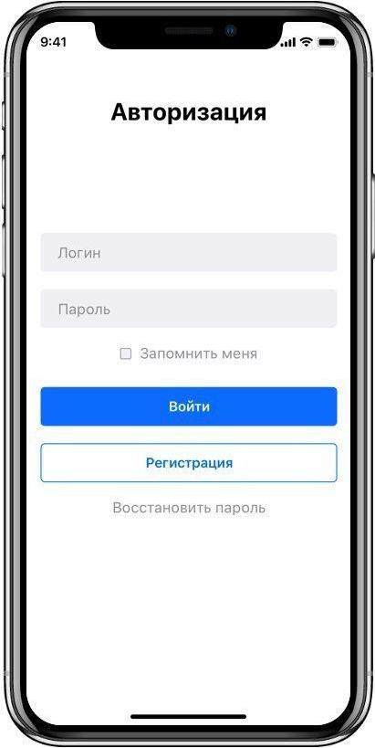

# Практическая работа №2 по Программированию корпоративных систем

## Вайгачев Никита Владимирович ЭФБО-01-22

### Верстка по прототипу

Прототип:

)

Результат:
1. Кнопка "Запомнить меня" - CheckBox
2. Регистрация - ElevatedButton
3. Войти - OutlinedButton
4. Восстановить пароль - TextButton
5. Логин и Пароль - TextField, пароль скрыт с помощью obscureText

